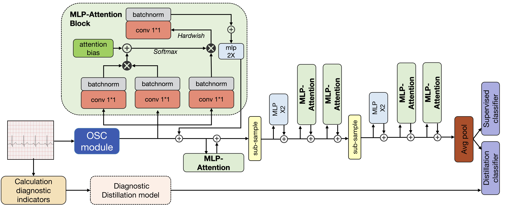

# Enhancing Interpretability in ECG Classification: A Physician-Informed Momentum Distillation Transformer Approach

This repository contains the implementation of the Momentum Distillation Oscillographic Transformer (MDOT) method for ECG classification, as described in our course(**Ethics in Artificial Intelligence**) project.

## Abstract



MDOT is a novel approach that combines medical knowledge with advanced machine learning techniques to improve ECG classification accuracy and interpretability. The method consists of three main components:

1. **OSC Module**: Transforms ECG data into multi-dimensional image format for better feature extraction
2. **Momentum Model**: Combines ResNeSt and XGBoost for medical momentum distillation
3. **Attention Model**: Enhances interpretability through local attention mechanisms

## Project Structure

```
.
├── KD_base_model/            # Knowledge Distillation and Base Model Implementation
│   ├── basemodel.py          # Base model architecture
│   ├── train_student.py      # Student model training
│   ├── train_teacher.py      # Teacher model training
│   ├── DKD.py                # Deep Knowledge Distillation
│   ├── KD.py                 # Knowledge Distillation
│   ├── PKT.py                # Probabilistic Knowledge Transfer
│   ├── SP.py                 # Similarity Preserving
│   ├── VID.py                # Virtual Instance Distillation
│   ├── criterion.py          # Loss functions
│   ├── loops.py              # Training loops
│   ├── memory.py             # Memory management
│   ├── pretrain.py           # Pretraining utilities
│   └── util.py               # Utility functions
├── Momentum Model/           # Momentum Model Implementation
│   ├── ECG_waves.py          # ECG waveform processing
│   ├── resnest + xgboost.py  # ResNeSt-XGBoost integration
│   ├── resnet.py             # ResNet implementation
│   ├── build.py              # Model building utilities
│   ├── loss.py               # Loss functions
│   └── splat.py              # Split-Attention implementation
├── main.py                   # Main training script
├── evaluation.py             # Evaluation metrics and reporting
├── visualization.py          # Visualization utilities
├── ecg_datasets.py           # Dataset handling
├── osc.py                    # OSC module implementation
├── requirements.txt          # Project dependencies
└── ECG_DATASET.rar           # ECG dataset
```

## Requirements

The project requires the following dependencies (specified in `requirements.txt`):

- Python 3.8+
- PyTorch 1.8+
- XGBoost 1.5.0+
- NumPy 1.19.2+
- Pandas 1.2.0+
- Scikit-learn 0.24.0+
- Matplotlib 3.3.0+
- Tqdm 4.50.0+
- Pillow 8.0.0+
- SciPy 1.6.0+
- PyUnrar 0.4+

## Installation

1. Clone the repository:
```bash
git clone https://github.com/DS-KB-lab/MDOT.git
cd MODT
```

2. Install dependencies:
```bash
pip install -r requirements.txt
```

3. Extract the ECG dataset:
```bash
unrar x ECG_DATASET.rar
```

## Usage

### Training the Model

The main training script handles both the momentum model and base model training:

```bash
python main.py --dataset mitbih --batch_size 32 --epochs 100 --lr 1e-4
```

Available arguments:
- `--dataset`: Choose between 'mitbih' or 'chapman' (default: mitbih)
- `--batch_size`: Batch size for training (default: 32)
- `--epochs`: Number of training epochs (default: 100)
- `--lr`: Learning rate (default: 1e-4)
- `--device`: Device to use (default: cuda if available)
- `--save_dir`: Directory to save results (default: results)

### Dataset Preparation

The code supports both MIT-BIH and Chapman ECG databases. Use `ecg_datasets.py` to prepare your dataset:

```python
from ecg_datasets import ECGDataset

# For MIT-BIH dataset
dataset = ECGDataset(dataset_type='mitbih', split='train')

# For Chapman dataset
dataset = ECGDataset(dataset_type='chapman', split='train')
```

### Visualization

The `visualization.py` module provides several plotting functions:

```python
from visualization import plot_attention_weights, plot_confusion_matrix, plot_training_metrics

# Plot attention weights
plot_attention_weights(attention_weights, ecg_signal, save_path='attention.png')

# Plot confusion matrix
plot_confusion_matrix(confusion_matrix, class_names, save_path='confusion.png')

# Plot training metrics
plot_training_metrics(train_losses, val_losses, train_accs, val_accs, save_path='metrics.png')
```

### Evaluation

The `evaluation.py` module provides comprehensive evaluation metrics:

```python
from evaluation import ECGEvaluator

# Initialize evaluator
evaluator = ECGEvaluator(num_classes=8)

# Update with predictions
evaluator.update(predictions, targets)

# Get metrics
metrics = evaluator.compute_metrics()

# Print report
evaluator.print_report(class_names)
```

## License

This project is licensed under the MIT License - see the LICENSE file for details.

## Acknowledgments

- MIT-BIH Arrhythmia Database
- Chapman ECG Database
- CTKD and LeViT teams
